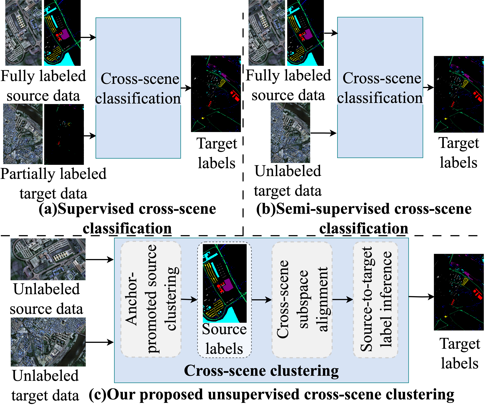
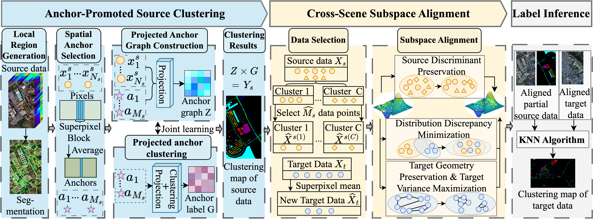
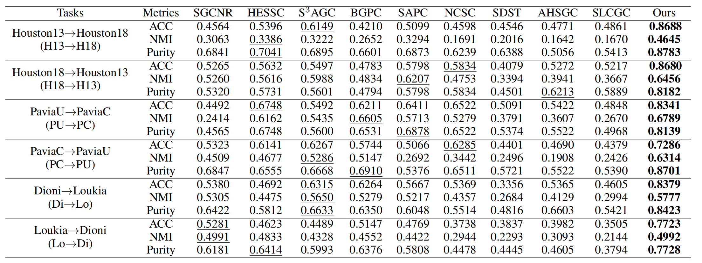

# ADSAC: Anchor-Guided Discriminative Subspace Alignment and Clustering for Cross-Scene Hyperspectral Imagery

> **AAAI 2026** | [Paper](https://ojs.aaai.org/index.php/AAAI/article/view/38295) | [Code](https://github.com/ZhangYongshan/ADSAC)

Official implementation of **ADSAC**, the first framework for **cross-scene hyperspectral image (HSI) clustering** without label guidance in either source or target scenes.

## Overview

Existing cross-scene HSI recognition methods rely on labeled source data. ADSAC removes this requirement entirely — no labels needed for either scene — making it suitable for real-world deployment where pixel-level annotation is costly and time-consuming.
<p align="center">
  
  <br>
  <em>Figure 1: Different cross-scene HSI recognition styles. ADSAC (c) requires no labels in either scene.</em>
</p>


ADSAC follows a structured **three-step learning paradigm**:


<p align="center">
  
  <br>
  <em>Figure 1: Different cross-scene HSI recognition styles. ADSAC (c) requires no labels in either scene.</em>
</p>


## Key Contributions

- **First cross-scene HSI clustering framework** — operates without any label supervision in both source and target scenes.
- **APGL (Anchor-Promoted Graph Learning)** — derives accurate source clustering labels using entropy rate superpixel (ERS) segmentation and joint anchor graph construction with clustering exploration.
- **DCSA (Discriminative Cross-Scene Subspace Alignment)** — jointly enforces source discriminant preservation, target geometry preservation, target variance maximization, and conditional distribution discrepancy minimization via MMD.
- **Tailored optimization algorithms** — alternating updates for APGL; generalized eigenvalue decomposition for DCSA; near-linear complexity in sample count.

---

## Results

ADSAC is evaluated on **6 cross-scene clustering tasks** across three benchmark datasets and consistently outperforms 9 state-of-the-art HSI clustering methods.

<p align="center">
  
  <br>
  <em>Figure 1: Different cross-scene HSI recognition styles. ADSAC (c) requires no labels in either scene.</em>
</p>

---

## Datasets

| Dataset | Scenes | Size | Categories | Bands |
|---------|--------|------|-----------|-------|
| **Houston** | Houston2013, Houston2018 | 349×1905 each | 7 | 48 |
| **Pavia** | Pavia Center, Pavia University | 1096×715 / 610×340 | 7 | 102 |
| **HyRANK** | Dioni, Loukia | 250×1376 / 249×945 | 12 | 176 |

---

## Getting Started

### Requirements

- MATLAB 2022b (for ADSAC and shallow baselines)
- Python 3.10 (for deep learning baselines only)

### Installation

```bash
git clone https://github.com/ZhangYongshan/ADSAC.git
cd ADSAC
```

### Running ADSAC

```matlab
% In MATLAB
run main.m
```


## Method Details

### Step 1 — APGL (Anchor-Promoted Graph Learning)

Superpixel segmentation (ERS) is applied to the first principal component of the source scene to generate $M_s$ anchors. APGL then jointly optimizes:

- **Anchor graph construction** — learns a graph $\mathbf{Z} \in \mathbb{R}^{N_s \times M_s}$ measuring pixel-to-anchor proximity in a low-dimensional projected space.
- **Anchor-guided clustering exploration** — factorizes projected anchors into a centroid matrix $\mathbf{F}$ and cluster indicator $\mathbf{G}$.

Source pixel labels are computed as $\mathbf{Y}^s = \mathbf{Z}\mathbf{G}$.

### Step 2 — DCSA (Discriminative Cross-Scene Subspace Alignment)

Learns projection matrices $\mathbf{W}_s, \mathbf{W}_t \in \mathbb{R}^{D \times R}$ by optimizing four objectives simultaneously:

1. **Source Discriminant Preservation** — Fisher-style intra-class compactness and inter-class separability.
2. **Target Geometry Preservation** — graph Laplacian-based manifold structure retention.
3. **Target Variance Maximization** — PCA-inspired feature spread for cluster separability.
4. **Distribution Discrepancy Minimization** — conditional MMD between source and target.

Solved efficiently via generalized eigenvalue decomposition.

### Step 3 — Label Inference

A KNN classifier trained on aligned, clustering-labeled source data is applied to the aligned target data to produce final target labels $\mathbf{Y}^t$.

---

## Ablation Study

| Modules | H13→H18 | H18→H13 | PU→PC | PC→PU | Di→Lo | Lo→Di |
|---------|---------|---------|-------|-------|-------|-------|
| Neither | 0.3999 | 0.4272 | 0.5633 | 0.5233 | 0.5236 | 0.5163 |
| APGL only | 0.4638 | 0.5506 | 0.7008 | 0.6004 | 0.6859 | 0.6052 |
| DCSA only | 0.5335 | 0.5725 | 0.6430 | 0.6211 | 0.6250 | 0.6972 |
| **Full ADSAC** | **0.8688** | **0.8418** | **0.8341** | **0.7286** | **0.8379** | **0.7723** |

---

## Citation

If you find this work useful, please cite:

```bibtex
@inproceedings{zhang2026adsac,
  title     = {Anchor-Guided Discriminative Subspace Alignment and Clustering for Cross-Scene Hyperspectral Imagery},
  author    = {Zhang, Yongshan and Zhang, Zixuan and Wang, Xinxin and Zhang, Lefei and Cai, Zhihua},
  booktitle = {Proceedings of the AAAI Conference on Artificial Intelligence},
  year      = {2026}
}
```

---


---

## Contact

- Yongshan Zhang — yszhang.cug@gmail.com  
- Zixuan Zhang — zzixuan@cug.edu.cn  
- Xinxin Wang (Corresponding) — xinxinwang1024@gmail.com
